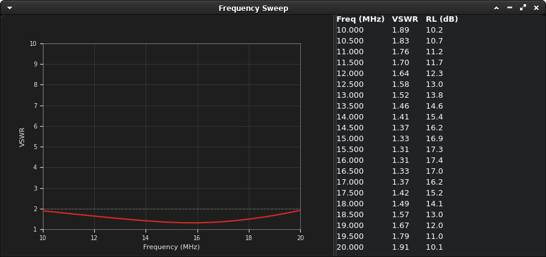
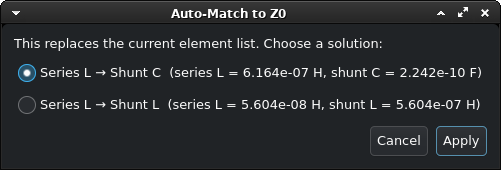

# Smith Chart Matching Tool — with Automatic L-Network

A small GTK4 app for visualizing impedance matching: enter a source
impedance, add series/shunt R/L/C elements, and watch each one trace
its arc across the Smith chart. Live readouts for Z, Gamma, VSWR, and
return loss.






## Files

- `engine.py` — core impedance math (no GUI deps). `MatchingNetwork`
  holds a source Z and an ordered list of series/shunt R/L/C elements,
  and computes the impedance after each step, plus Gamma/VSWR/return loss.
  `solve_l_match()` analytically computes a 1- or 2-element L-network that
  exactly matches a given source Z to Z0. This is fully unit-testable on
  its own.
- `chart.py` — draws the Smith chart grid: constant-R circles and
  constant-X arcs (impedance), plus a fainter overlay of the mirrored
  constant-G/constant-B admittance grid, both labeled with actual
  ohm values scaled to Z0. Maps Z -> Gamma for plotting points and paths.
  Also draws the VSWR-vs-frequency sweep plot.
- `schematic.py` — draws the matching network as a ladder-network
  schematic (IEC 60617-style symbols: resistor box, inductor coil,
  capacitor plates), series elements inline and shunt elements branching
  to ground. Used for the schematic/report exports, not shown live.
- `app.py` — the GTK4 windows: the main window (source Z0/R/X/frequency
  entries, an "Add element" list where each row is (series/shunt, R/L/C,
  value, unit), the Smith chart, and result readouts) plus a separate
  "Frequency Sweep" window (VSWR-vs-frequency plot and results table,
  side by side). All the major panes are separated by draggable dividers.

## Setup (Debian/Ubuntu)

```bash
sudo apt install python3-gi gir1.2-gtk-4.0 python3-matplotlib python3-numpy
```

## Run

```bash
python3 app.py
```

## Using it

1. Set Z0 (system impedance, usually 50), frequency, and the source
   R + jX you're trying to match (e.g. from your antenna feedpoint
   measurement).
   - Or click **Auto-Match to Z0…** to have it solve for you: it computes
     the L-network (1 or 2 components) that matches exactly, offers a
     choice between solutions when more than one exists (e.g. series L +
     shunt C vs. series L + shunt L), and fills in the element list for
     whichever one you pick.
2. Click "+ Add element" to add a matching component by hand. Choose:
   - **series** or **shunt** (topology)
   - **R**, **L**, or **C** (component type)
   - the value and a unit — Ω/kΩ/MΩ for R, mH/µH/nH/pH for L,
     mF/µF/nF/pF for C
3. Each element appears as a colored arc on the chart, moving the
   impedance point along a constant-resistance circle (series) or
   constant-conductance circle (shunt), the same way you'd reason
   through a match by hand on paper.
4. The final point (green star) and the readouts on the left show how
   close you are to Z0 — aim for VSWR near 1.0 / |Gamma| near 0.
5. Hover the mouse over the chart to see the impedance and VSWR at the
   pointer (e.g. `Pointer: Z = 12.34-56.78j Ω   VSWR = 3.42`) below the
   canvas — handy for reading off arbitrary points on the grid, not
   just the plotted ones.
6. The **Frequency sweep** section (Start/Stop MHz, Steps) evaluates the
   same source + elements across a frequency range instead of just the
   single Freq value, so you can check a match's bandwidth. Results show
   up live in the separate "Frequency Sweep" window (plot and table side
   by side) — see the View menu to show/hide it, or overlay the swept
   points directly on the Smith chart.

## File menu

- **Open… / Save / Save As…** (`Ctrl+O` / `Ctrl+S` / `Ctrl+Shift+S`) —
  save the source settings (Z0, frequency, source R/X), the frequency
  sweep range (Start/Stop/Steps), and the full element list to a JSON
  file, or reload one later. Handy for keeping a matching network per
  antenna/band around instead of re-entering values by hand.
- **Export Chart to PNG…** (`Ctrl+E`) — save the current Smith chart
  (grid, arcs, and points as currently drawn) as a PNG image.
- **Export Chart to PDF…** — the same chart as a single-page PDF, sized
  to the paper size chosen in the View menu.
- **Export Schematic to PNG…** — save the matching network's schematic
  diagram as a PNG image.
- **Export Report to PDF (Chart + Schematic + Sweep)…** — a multi-page
  PDF: the Smith chart (portrait), the schematic (landscape), the
  VSWR-vs-frequency sweep plot (landscape), and the sweep results table
  (portrait, paginated if it's long).
- **Export Sweep Table to CSV…** (`Ctrl+Shift+E`) — save the frequency
  sweep results (Freq/VSWR/Return Loss) as a CSV file.
- **Quit** (`Ctrl+Q`).

## View menu

- **Light / Dark** — built-in color presets for the chart (background
  and grid/boundary/marker color).
- **Custom Colors…** — pick your own background and chart color live.
- Whichever theme you land on (a preset or custom colors) is remembered
  across restarts, saved to `~/.config/lsmith/config.json`.
- **Show Sweep Points on Chart** — overlay the swept frequency points
  (dots joined by straight lines) on the Smith chart itself.
- **Show Sweep Window** — show/hide the separate "Frequency Sweep"
  window; closing it from its own titlebar does the same thing, and
  this checkbox always reflects whether it's currently open.
- **PDF Paper Size** — A4 / Letter / Legal for the PDF exports above.
  Defaults to your system's configured paper size (via GTK's print
  settings) the first time you run the app, and is remembered after that.
