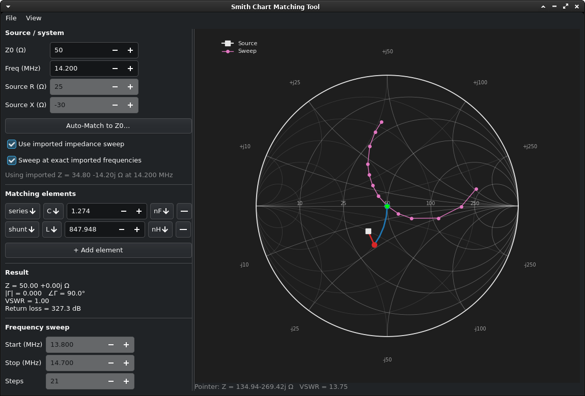

# Smith Chart Matching Tool

A small GTK4 app for visualizing impedance matching: enter a source
impedance, add series/shunt R/L/C elements, and watch each one trace
its arc across the Smith chart. Live readouts for Z, Gamma, VSWR, and
return loss.



## Files

- `engine.py` — core impedance math (no GUI deps). `MatchingNetwork`
  holds a source Z and an ordered list of series/shunt R/L/C elements,
  and computes the impedance after each step, plus Gamma/VSWR/return loss.
  This is fully unit-testable on its own.
- `chart.py` — draws the Smith chart grid: constant-R circles and
  constant-X arcs (impedance), plus a fainter overlay of the mirrored
  constant-G/constant-B admittance grid, both labeled with actual
  ohm values scaled to Z0. Maps Z -> Gamma for plotting points and paths.
- `app.py` — the GTK4 window: source Z0/R/X/frequency entries, an
  "Add element" list where each row is (series/shunt, R/L/C, value),
  and an embedded matplotlib canvas showing the chart + result readouts.

## Setup (Debian/Ubuntu)

```bash
sudo apt install python3-gi gir1.2-gtk-4.0 python3-matplotlib python3-numpy
```

## Run

```bash
python3 app.py
```

## Using it

1. Set Z0 (system impedance, usually 50), frequency, and the source
   R + jX you're trying to match (e.g. from your antenna feedpoint
   measurement).
2. Click "+ Add element" to add a matching component. Choose:
   - **series** or **shunt** (topology)
   - **R**, **L**, or **C** (component type)
   - the value and a unit — Ω/kΩ/MΩ for R, mH/µH/nH/pH for L,
     mF/µF/nF/pF for C
3. Each element appears as a colored arc on the chart, moving the
   impedance point along a constant-resistance circle (series) or
   constant-conductance circle (shunt), the same way you'd reason
   through a match by hand on paper.
4. The final point (green star) and the readouts on the left show how
   close you are to Z0 — aim for VSWR near 1.0 / |Gamma| near 0.
5. Hover the mouse over the chart to see the impedance and VSWR at the
   pointer (e.g. `Pointer: Z = 12.34-56.78j Ω   VSWR = 3.42`) below the
   canvas — handy for reading off arbitrary points on the grid, not
   just the plotted ones.

## File menu

- **Open… / Save / Save As…** (`Ctrl+O` / `Ctrl+S` / `Ctrl+Shift+S`) —
  save the source settings (Z0, frequency, source R/X) and the full
  element list to a JSON file, or reload one later. Handy for keeping
  a matching network per antenna/band around instead of re-entering
  values by hand.
- **Export to PNG…** (`Ctrl+E`) — save the current Smith chart (grid,
  arcs, and points as currently drawn) as a PNG image.
- **Quit** (`Ctrl+Q`).

## View menu

- **Light / Dark** — built-in color presets for the chart (background
  and grid/boundary/marker color).
- **Custom Colors…** — pick your own background and chart color live.
- Whichever theme you land on (a preset or custom colors) is remembered
  across restarts, saved to `~/.config/lsmith/config.json`.
